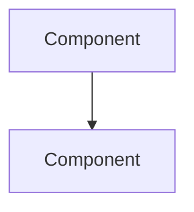

# Prompt-Driven Development: Design Phase

Create a detailed design document based on requirements and research.

## Prerequisites

Before running this command, ensure:
- `planning/idea-honing.md` exists with requirements
- `planning/research/` contains relevant research (if applicable)

## Process

### 1. Review Context

Read and summarize:
- `planning/rough-idea.md` - Original concept
- `planning/idea-honing.md` - Refined requirements
- `planning/research/*.md` - Research findings

### 2. Create Detailed Design

Create `planning/design/detailed-design.md` with these sections:

```markdown
# [Feature Name] - Detailed Design

## 1. Overview
Brief description of what we're building and why.

## 2. Requirements Summary
Key requirements from idea-honing phase.

## 3. Architecture

### System Context
How this fits into the overall project architecture.

### Component Diagram


### Data Flow
How data moves through the system.

## 4. Components and Interfaces

### API Endpoints (if applicable)
| Method | Path | Description |
|--------|------|-------------|
| GET | /api/v1/... | ... |

### Key Functions/Services
| Name | Purpose | Dependencies |
|------|---------|--------------|
| ... | ... | ... |

## 5. Data Models

### Schema/Types
Document the key data structures and their relationships.

## 6. Security Considerations
- Authentication/authorization approach
- Data encryption requirements
- Input validation

## 7. Error Handling
- Error codes and messages
- Retry strategies
- Fallback behavior

## 8. Testing Strategy
- Unit test approach
- Integration test approach
- E2E test scenarios

## 9. Open Questions
Any unresolved decisions or unknowns.
```

### 3. Specialist Reviews

Use subagents for parallel review if available:
- **solutions-architect**: Review overall architecture
- **security-engineer**: Review security aspects

### 4. Iterate on Feedback

Present the design to me for review. Address any feedback before finalizing.

### 5. Architecture Decision Records

If significant decisions were made, create ADRs in `knowledge-base/decisions/`:

```markdown
# ADR-{N}: {Title}

## Status
Accepted

## Context
{Why this decision was needed}

## Decision
{What we decided}

## Consequences
{Impact of this decision}
```

## Output

After completing this phase:
- `planning/design/detailed-design.md` - Main design document
- `knowledge-base/decisions/adr-*.md` - Any ADRs created
- Summary of design ready for implementation

## Next Steps

After design approval, use `/pdd-implement` to create the implementation plan.
